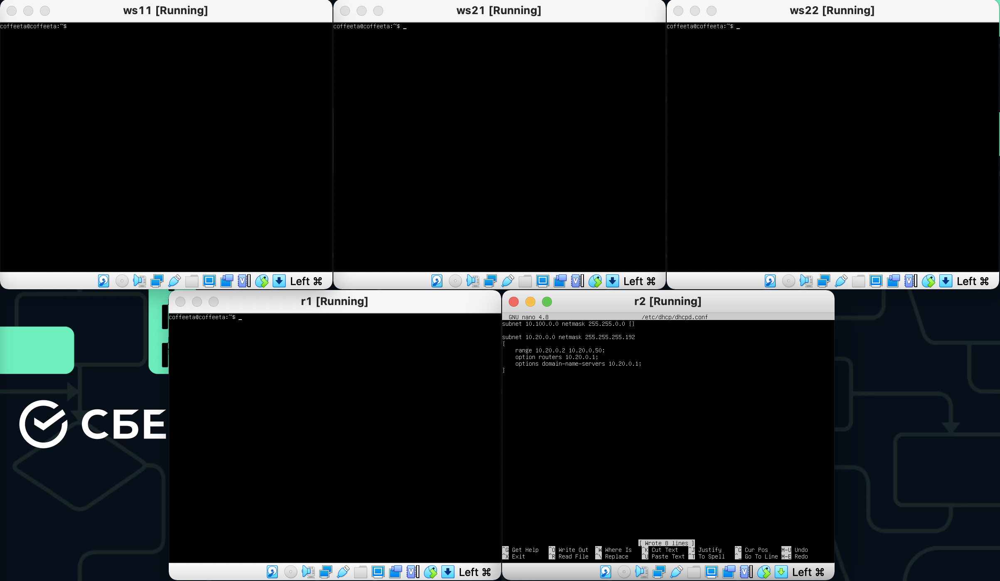
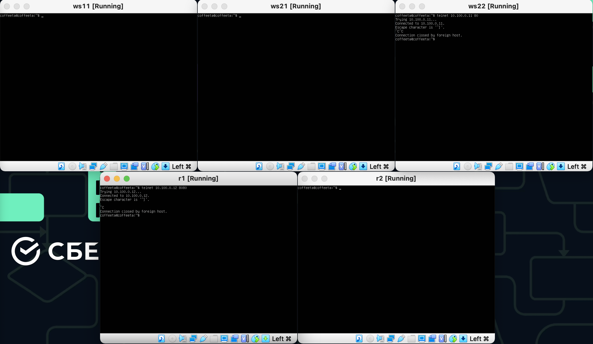

## Part 1. ipcalc tool

Start a virtual machine (hereafter -- ws1)

### 1.1. Networks and Masks

1. The network address of 192.167.38.54/13 is `192.160.0.0`.

   Command: `ipcalc 192.167.38.54/13`\
   

2. Here are the conversions of the masks:

   - Conversion of the mask `255.255.255.0` to prefix and binary:
   
     - Prefix: `/24`
     - Binary: `11111111.11111111.11111111.00000000`
     
   - Conversion of the prefix `/15` to normal and binary:
   
     - Normal: `255.254.0.0`
     - Binary: `11111111.11111110.00000000.00000000`
     
   - Conversion of the binary address `11111111.11111111.11111111.11110000` to normal and prefix:
   
     - Normal: `255.255.255.240`
     - Prefix: `/28`

   Command: `ipcalc 255.255.255.0`, `ipcalc /15`, `ipcalc 11111111.11111111.11111111.11110000`
   
   
   

3. Here are the minimum and maximum host addresses for the network `12.167.38.4` with the following masks:

   - `/8`:
   
     - Minimum: `12.0.0.1`
     - Maximum: `12.255.255.254`
     
   - `11111111.11111111.00000000.00000000`:
   
     - Minimum: `12.167.0.1`
     - Maximum: `12.167.255.254`
     
   - `255.255.254.0`:
   
     - Minimum: `12.167.38.1`
     - Maximum: `12.167.39.254`
     
   - `/4`:
   
     - Minimum: `8.0.0.1`
     - Maximum: `15.255.255.254`
     
   Command: `ipcalc 12.167.38.4/8`, `ipcalc 12.167.38.4/16`, `ipcalc 12.167.38.4/23`, `ipcalc 12.167.38.4/4`
   
   
   
   

### 1.2. localhost

An application running on localhost can only be accessed through the IP address `127.0.0.1`. It cannot be accessed through any of the other listed IP addresses (`194.34.23.100`, `127.0.0.2`, `127.1.0.1`, `128.0.0.1`).

### 1.3. Network ranges and segments

1. Here are the listed IPs and which ones can be used as public and private:

   - `10.0.0.45`: Private
   - `134.43.0.2`: Public
   - `192.168.4.2`: Private
   - `172.20.250.4`: Private
   - `172.0.2.1`: Invalid IP address (Octet 2 cannot be 0)
   - `192.172.0.1`: Public
   - `172.68.0.2`: Public
   - `172.16.255.255`: Private
   - `10.10.10.10`: Private
   - `192.169.168.1`: Public

2. The possible gateway IP addresses for the `10.10.0.0/18` network are `10.10.0.1`, `10.10.0.2`, `10.10.0.3`, `10.10.0.4`, `10.10.0.5`, `10.10.0.6`, `10.10.0.7`, `10.10.0.8`, `10.10.0.9`, `10.10.0.10`, `10.10.100.1`, `10.10.255.254`, and `10.10.255.255`.

   Command: `ipcalc -n 10.10.0.0/18 | grep HostMin | grep -oE "\b([0-9]{1,3}\.){3}[0-9]{1,3}\b" && ipcalc -n 10.10.0.0/18 | grep HostMax | grep -oE "\b([0-9]{1,3}\.){3}[0-9]{1,3}\b"`
   

## Part 2. Static routing between two machines

Start two virtual machines (hereafter -- ws1 and ws2)

### View existing network interfaces with the `ip a` command


### Describe the network interface corresponding to the internal network on both machines and set the following addresses and masks: ws1 - *192.168.100.10*, mask */16 *, ws2 - *172.24.116.8*, mask */12*

Identify the network interface corresponding to the internal network on both machines. Typically, this is the interface with the IP address range of 192.168.x.x or 10.x.x.x. Let's assume the interface on ws1 is called "enp0s3" and the interface on ws2 is called "enp0s3".\

On ws1, set the IP address and subnet mask for the internal network interface to 192.168.100.10/16 by modifying the /etc/netplan/00-installer-config.yaml file with the following configuration:\

`network:`\
`  version: 2`\
`  ethernets:`\
`    enp0s3:`\
`      addresses:`\
`        - 192.168.100.10/16`\

On ws2, set the IP address and subnet mask for the internal network interface to 172.24.116.8/12 by modifying the /etc/netplan/00-installer-config.yaml file with the following configuration:\

`network:`\
`  version: 2`\
`  ethernets:`\
`    enp0s3:`\
`      addresses:`\
`        - 172.24.116.8/12`\


Apply the changes to the network service by running the following command on both machines: `sudo netplan apply`


### 2.1. Adding a static route manually

Adding a static route from one machine to another and back using a
`ip r add` command.\
`sudo ip r add 172.24.116.8 dev enp0s8`\
`sudo ip r add 192.168.100.10 dev enp0s8`


### 2.2. Adding a static route with saving

Adding static route from one machine to another using *etc/netplan/00-installer-config.yaml* file.


Pinging the connection between the machines.


## Part 3. **iperf3** utility

In this task you need to use ws1 and ws2 from *Part 2*.

### 3.1. Connection speed

Convert and write results in the report: 8 Mbps to MB/s, 100 MB/s to Kbps, 1 Gbps to Mbps.\

To convert units of data transfer rate, we can use the following conversion factors:

- 1 Megabit per second (Mbps) = 0.125 Megabytes per second (MB/s)
- 1 Megabyte per second (MB/s) = 8 Megabits per second (Mbps)
- 1 Kilobit per second (Kbps) = 0.0009765625 Megabytes per second (MB/s)
- 1 Gigabit per second (Gbps) = 1000 Megabits per second (Mbps)

Using these conversion factors, we can convert the following data transfer rates:

- 8 Mbps to MB/s:

  8 Mbps = 8 * 0.125 MB/s = 1 MB/s

  Therefore, 8 Mbps is equivalent to 1 MB/s.

- 100 MB/s to Kbps:

  100 MB/s = 100 * 8 Mbps = 800 Mbps = 800,000 Kbps

  Therefore, 100 MB/s is equivalent to 800,000 Kbps.

- 1 Gbps to Mbps:

  1 Gbps = 1000 Mbps

  Therefore, 1 Gbps is equivalent to 1000 Mbps.

### 3.2. **iperf3** utility

Installing **iperf3** utility.


Measuring connection speed between ws1 and ws2.


## Part 4. Network firewall

In this task you need to use ws1 and ws2 from *Part 2*.

### 4.1. **iptables** utility

The following command to create a new file named /etc/firewall.sh: `sudo nano /etc/firewall.sh`

The following rules should be added to the file in a row:
1) on ws1 apply a strategy where a deny rule is written at the beginning and an allow rule is written at the end (this applies to points 4 and 5)
2) on ws2 apply a strategy where an allow rule is written at the beginning and a deny rule is written at the end (this applies to points 4 and 5)
3) open access on machines for port 22 (ssh) and port 80 (http)
4) reject *echo reply* (machine must not ping, i.e. there must be a lock on OUTPUT)
5) allow *echo reply* (machine must be pinged)

The following command to create a new file named /etc/firewall.sh `sudo nano /etc/firewall.sh`


Make the file executable on both machines by typing the following command `sudo chmod +x /etc/firewall.sh`

Run the script on both machines by typing the following command `sudo /etc/firewall.sh`


In the first file, the strategy used is to deny all traffic by default and then allow specific traffic on certain ports. This is a typical example of a "default-deny" approach to firewall configuration. In this strategy, all traffic is blocked by default unless it is explicitly allowed.

On the other hand, in the second file, the strategy used is to allow all traffic by default and then deny specific traffic on certain ports. This is an example of a "default-allow" approach to firewall configuration. In this strategy, all traffic is allowed by default unless it is explicitly denied.

The main difference between these two strategies is the way they approach security. The default-deny approach is generally considered more secure because it ensures that only traffic that is explicitly allowed is allowed through the firewall. However, it can be more difficult to manage because every allowed traffic must be explicitly configured. The default-allow approach, while easier to manage, can be less secure because it allows all traffic through by default, and specific traffic must be explicitly denied.

Ultimately, the choice of strategy depends on the specific needs and requirements of the network and the level of security that is necessary.

### 4.2. **nmap** utility

Use **ping** command to find a machine which is not pinged, then use **nmap** utility to show that the machine host is up


### Save dumps of the virtual machine images


## Part 5. Static network routing

Network: \


Start five virtual machines (3 workstations (ws11, ws21, ws22) and 2 routers (r1, r2))

### 5.1. Configuration of machine addresses

Set up the machine configurations in *etc/netplan/00-installer-config.yaml* according to the network in the picture.


Restart the network service. If there are no errors, check that the machine address is correct with the `ip -4 a` command.


Also ping ws22 from ws21. Similarly ping r1 from ws11.


### 5.2. Enabling IP forwarding.

To enable IP forwarding, run the following command on the routers:
`sysctl -w net.ipv4.ip_forward=1`.


Open */etc/sysctl.conf* file and add the following line:
`net.ipv4.ip_forward = 1`.


### 5.3. Default route configuration

Configure the default route (gateway) for the workstations. To do this, add `default` before the router's IP in the configuration file.


Call `ip r` and show that a route is added to the routing table.


Ping r2 router from ws11 and show on r2 that the ping is reaching. To do this, use the `tcpdump -tn -i eth1` command.


### 5.4. Adding static routes

Add static routes to r1 and r2 in configuration file.


Call `ip r` and show route tables on both routers.


Run `ip r list 10.10.0.0/[netmask]` and `ip r list 0.0.0.0/0` commands on ws11.


The reason why a different route other than the default route (0.0.0.0/0) has been selected for `10.10.0.0/[netmask]` is that the routing table on ws11 has a more specific route for the `10.10.0.0/18` subnet than the default route.

When a packet is sent to a destination IP address, the routing table is checked to determine the best path for that packet to take. The routing table contains multiple entries, each specifying a network or a host and the corresponding next-hop to reach that network or host.

In this case, the routing table on ws11 has an entry for the `10.10.0.0/18` subnet with a more specific netmask than the default route. As a result, when a packet is destined for the `10.10.0.0/18` subnet, the more specific route is chosen over the default route, since it provides a more direct path to the destination network.

It is generally good practice to have more specific routes in the routing table, as they provide a more efficient path to the destination network and reduce the number of hops required to reach it.

### 5.5. Making a router list

Run the `tcpdump -tnv -i eth0` dump command on r1.\
Use **traceroute** utility to list routers in the path from ws11 to ws21.


Traceroute works by sending packets with increasing TTL (Time-to-Live) values towards the destination. TTL limits the number of routers or hops that a packet can pass through before it is discarded. Each router along the path decrements the TTL value of the packet by one. When the TTL value of a packet reaches zero, the router that processed the packet discards it and sends an ICMP "time exceeded" message back to the source.

Traceroute sends a series of packets with increasing TTL values, and each router along the path sends back an ICMP "time exceeded" message with its IP address. Traceroute then displays the IP addresses of the routers in the order they were encountered, which gives an indication of the path taken by the packets to reach the destination.

The output of traceroute also shows the time taken for each packet to reach the destination and for the ICMP message to be returned. By sending multiple packets and taking the average of the response times, traceroute can provide an estimate of the round-trip time (RTT) between the source and destination.

### 5.6. Using **ICMP** protocol in routing

Run on r1 network traffic capture going through eth0 with the
`tcpdump -n -i eth0 icmp` command.\
Ping a non-existent IP (e.g. *10.30.0.111*) from ws11 with the
`ping -c 1 10.30.0.111` command.


## Part 6. Dynamic IP configuration using **DHCP**

*In this task you need to use virtual machines from Part 5*

##### For r2, configure the **DHCP** service in the */etc/dhcp/dhcpd.conf* file:

##### 1) specify the default router address, DNS-server and internal network address. Here is an example of a file for r2:
```shell
subnet 10.100.0.0 netmask 255.255.0.0 {}

subnet 10.20.0.0 netmask 255.255.255.192
{
    range 10.20.0.2 10.20.0.50;
    option routers 10.20.0.1;
    option domain-name-servers 10.20.0.1;
}
```
##### 2) write `nameserver 8.8.8.8.` in a *resolv.conf* file




##### Restart the **DHCP** service with `systemctl restart isc-dhcp-server`. Reboot the ws21 machine with `reboot` and show with `ip a` that it has got an address. Also ping ws22 from ws21.


##### Specify MAC address at ws11 by adding to *etc/netplan/00-installer-config.yaml*:
`macaddress: 10:10:10:10:10:BA`, `dhcp4: true`


##### Сonfigure r1 the same way as r2, but make the assignment of addresses strictly linked to the MAC-address (ws11). Run the same tests


For ws11 command `sudo reboot` and `ip a`


##### Request ip address update from ws21


## Part 7. **NAT**

*In this task you need to use virtual machines from Part 5*

##### In */etc/apache2/ports.conf* file change the line `Listen 80` to `Listen 0.0.0.0:80`on ws22 and r1, i.e. make the Apache2 server public


##### Start the Apache web server with `service apache2 start` command on ws22 and r1


##### Add the following rules to the firewall, created similarly to the firewall from Part 4, on r2:
##### 1) delete rules in the filter table - `iptables -F`
##### 2) delete rules in the "NAT" table - `iptables -F -t nat`
##### 3) drop all routed packets - `iptables --policy FORWARD DROP`
##### Run the file as in Part 4


##### Check the connection between ws22 and r1 with the `ping` command
*When running the file with these rules, ws22 should not ping from r1*


##### Add another rule to the file:
##### 4) allow routing of all **ICMP** protocol packets


##### Add two more rules to the file:
##### 5) enable **SNAT**, which is masquerade all local ip from the local network behind r2 (as defined in Part 5 - network 10.20.0.0)
*Tip: it is worth thinking about routing internal packets as well as external packets with an established connection*
##### 6) enable **DNAT** on port 8080 of r2 machine and add external network access to the Apache web server running on ws22
*Tip: be aware that when you will try to connect, there will be a new tcp connection for ws22 and port 80


*Before testing it is recommended to disable the **NAT** network interface in VirtualBox (its presence can be checked with `ip a` command), if it is enabled*
##### Check the TCP connection for **SNAT** by connecting from ws22 to the Apache server on r1 with the `telnet [address] [port]` command
##### Check the TCP connection for **DNAT** by connecting from r1 to the Apache server on ws22 with the `telnet` command (address r2 and port 8080)



## Part 8. Bonus. Introduction to **SSH Tunnels**


*In this task you need to use virtual machines from Part 5*

##### Run a firewall on r2 with the rules from Part 7


##### Start the **Apapche** web server on ws22 on localhost only (i.e. in */etc/apache2/ports.conf* file change the line `Listen 80` to `Listen localhost:80`)


##### Use *Local TCP forwarding* from ws21 to ws22 to access the web server on ws22 from ws21


##### Use *Remote TCP forwarding* from ws11 to ws22 to access the web server on ws22 from ws11


##### To check if the connection worked in both of the previous steps, go to a second terminal (e.g. with the Alt + F2) and run the `telnet 127.0.0.1 [local port]` command.


